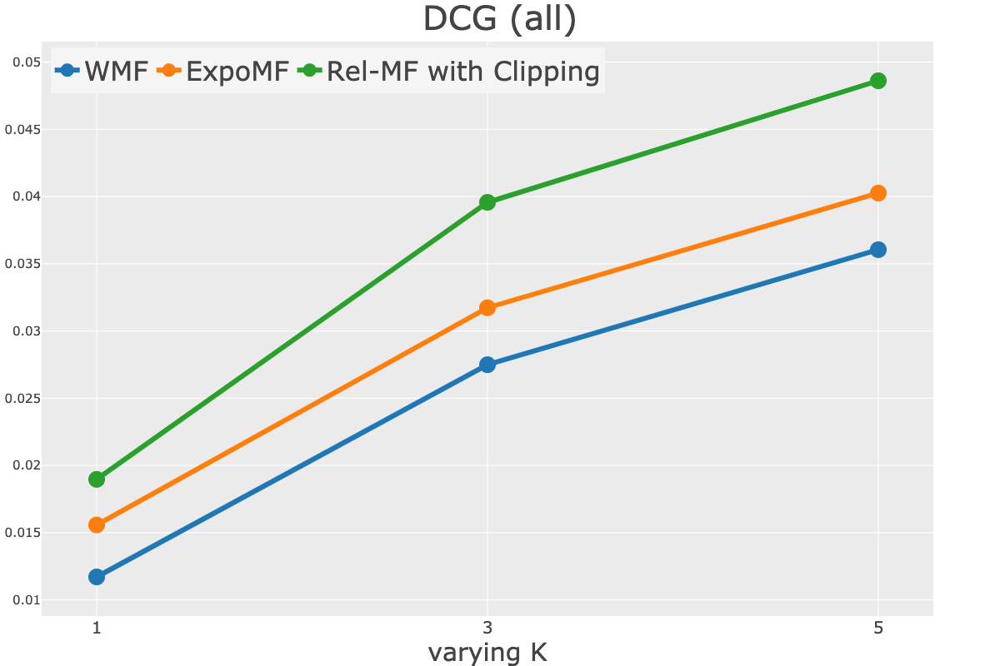
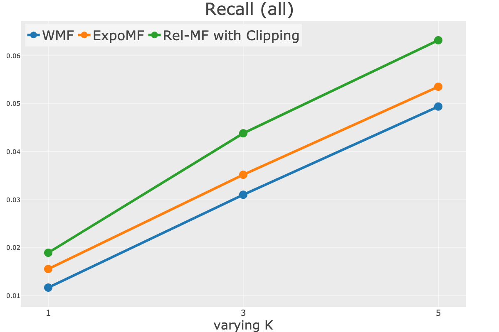
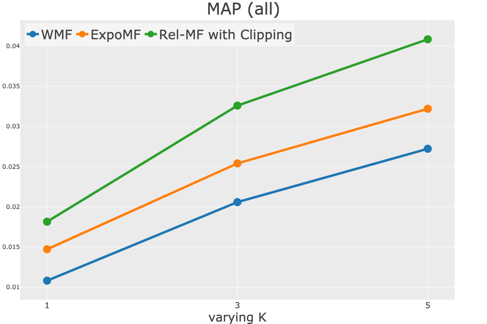
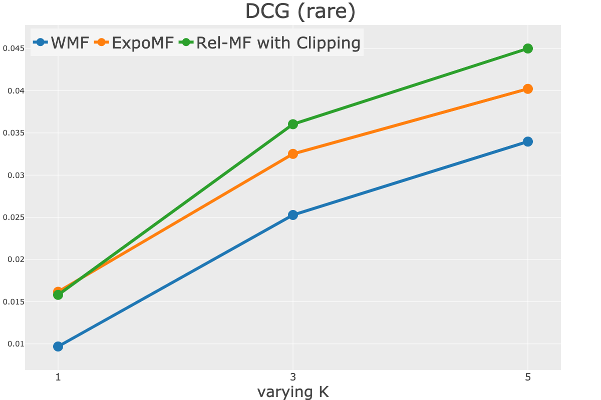
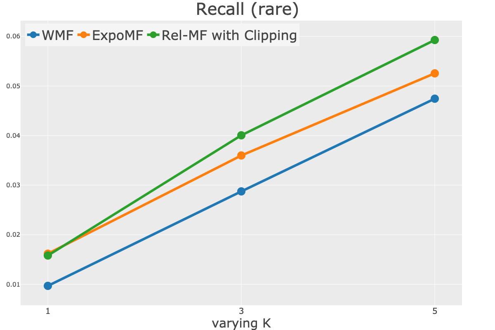

## Unbiased Recommender Learning from Missing-Not-At-Random Implicit Feedback

---

### About

This repository accompanies the real-world experiment conducted in the paper "[Unbiased Recommender Learning from Missing-Not-At-Random Implicit Feedback](https://dl.acm.org/doi/abs/10.1145/3336191.3371783)" by Yuta Saito, Suguru Yaginuma, Yuta Nishino, Hayato Sakata, and Kazuhide Nakata, which has been accepted to [WSDM'20](http://www.wsdm-conference.org/2020/index.php).

If you find this code useful in your research then please cite:

```
@inproceedings{saito2020unbiased,
  title={Unbiased Recommender Learning from Missing-Not-At-Random Implicit Feedback},
  author={Saito, Yuta and Yaginuma, Suguru and Nishino, Yuta and Sakata, Hayato and Nakata, Kazuhide},
  booktitle={Proceedings of the 13th International Conference on Web Search and Data Mining},
  pages={501--509},
  year={2020}
}
```

### Dependencies

- python==3.7.3
- numpy==1.16.2
- pandas==0.24.2
- scikit-learn==0.20.3
- tensorflow==1.15.0
- plotly==3.10.0
- mlflow==1.4.0
- pyyaml==5.1

### Running the code

To run the simulation with real-world data, download the [Yahoo! R3 dataset](https://webscope.sandbox.yahoo.com/catalog.php?datatype=r) and put train.txt and test.txt files into `data/` directory. Then, navigate to the `src/` directory and run the command

```bash
for model in wmf expomf crmf
do
  python main.py $model --preprocess_data &
done
```

This will run real-world experiments conducted in Section 6. After running the experimens, you can visualize the results by running the following command in the `src/` directory

```bash
python visualize.py
```

You can check the experimental parameters actually used in our experiments in the `config.yaml` file.

Once the code is finished executing, you can find the results of ranking metrics of all methods in `./logs/overall/` directory. In addition, the figures are stored in `./plots/results/` directory.

### Figures

By running the codes above, you can obtain the figures below.

|                |          Figure 2: DCG           |          Figure 2: Recall           | Figure 2: MAP                    |
| :------------: | :------------------------------: | :---------------------------------: | -------------------------------- |
| For all items  |   |   |   |
| For rare items |  |  |  |
